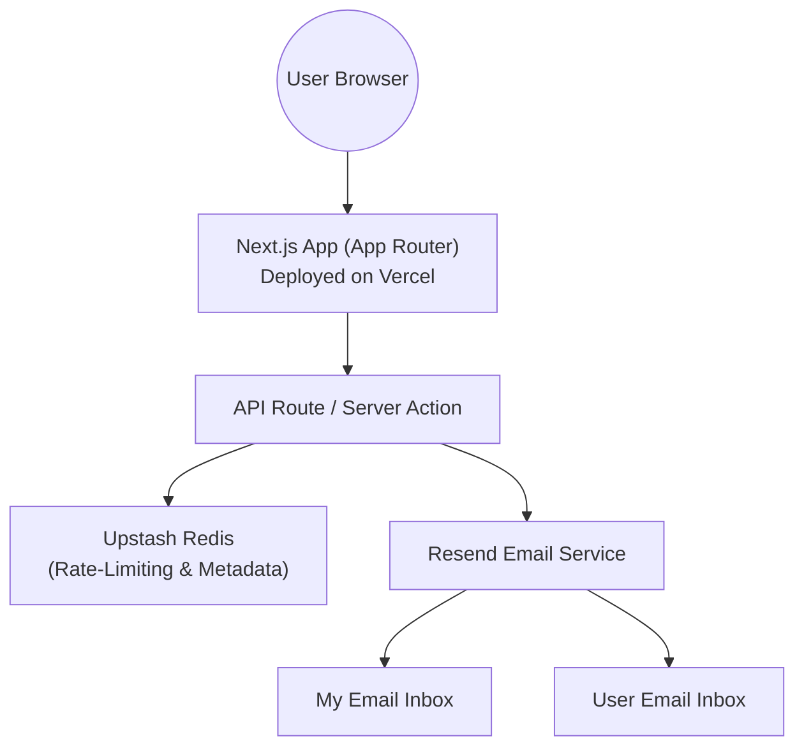

# Personal Portfolio Website — Architecture Overview

This repository provides a high-level overview of the architecture, technologies, and design patterns powering my personal website **[marcocastellani.dev](https://marcocastellani.dev)**.  
The project serves as a professional portfolio showcasing my work, skills, and experience across software development and system design.

No source code is included here for privacy and security reasons.  
Only architectural documentation and technology summaries are publicly available.

---

## 📐 Architecture Diagram

---

## 🧰 Tech Stack

### **Frontend & UI**

* **Next.js (App Router)** — modern React framework for full-stack, server-oriented apps
* **Tailwind CSS** — utility-first styling and responsive design
* **SSR/ISR Rendering** — high performance and SEO-friendly
* **Dark/Light Mode (system-based detection)**
* **Responsive layout + micro-animations** across sections

### **Backend & Infrastructure**

* **Vercel Hosting** — automatic builds and deployments from GitHub
* **API Routes / Server Actions** — handling form submissions and backend logic
* **Upstash Redis** — lightweight serverless storage for:

  * rate-limiting
  * metadata tracking
  * optional anti-spam fields
* **Resend** — transactional email service for:

  * notification emails sent to me
  * confirmation messages sent to users

### **Development Workflow**

* GitHub private repository → automatic Vercel deployment
* Production & Preview deployments
* Environment variables (security best practices)
* No exposed secrets, no client-side leakage

---

## ✉️ Contact Form Workflow

The website implements a secure and reliable contact form pipeline:

1. **User submits the form**
2. Inputs validated on both client and server
3. Request handled by a **Next.js API Route**
4. Metadata stored in **Upstash Redis** for:

   * rate-limiting
   * spam prevention
   * tracking submission frequency
5. **Resend** sends:

   * a notification email to my inbox
   * an automatic confirmation email to the user

No personal data is permanently stored.
All operations comply with privacy-oriented minimal retention.

---

## 🧩 Website Structure & Features

### **Pages**

* **Home** — introduction, animated header, links
* **About** — personal overview + minimal imagery
* **Projects** — categorized portfolio (University, Work, Music, etc.)
* **Resume** — public-safe CV (sensitive fields masked)
* **Contact** — form to reach me or request the full resume

### **UI/UX Features**

* System-based dark/light theme
* Smooth animations and transitions
* Responsive design on all breakpoints
* Hover-based image interactions
* Clean, minimal visual identity

### **Security & Anti-Spam**

* Basic server-side rate limiting
* Metadata validation via Upstash Redis
* Input sanitization
* No persistent storage of message bodies
* Email identity verification
* Optional invisible honeypot fields (anti-bot)

---

## 🚀 Deployment

The website is deployed via **Vercel**, with:

* Automatic deployment triggered by Git pushes
* Production + Preview environments
* Build logs, incremental page rendering, edge caching
* Environment variables managed securely in Vercel dashboard

---

## 🔒 Privacy Notice

This repository contains **no source code**, no production secrets, and no personal data.
All architectural details are generic and safe for public distribution.

---

## 📄 Purpose of This Repository

This repo exists to:

* Present the technical design of my website
* Demonstrate proficiency across modern web tooling
* Showcase backend integrations (API Routes, emails, Redis, etc.)
* Provide recruiters and technical reviewers a clear overview of the system
